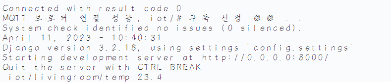
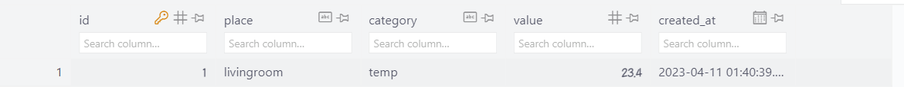
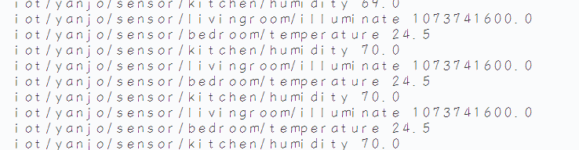
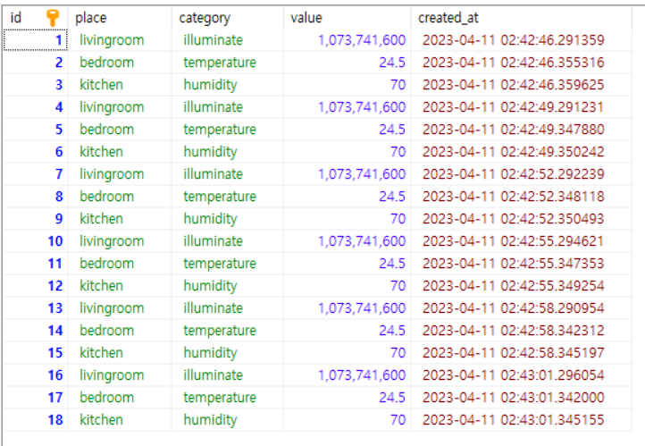
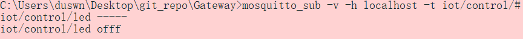

## MQTT 서비스 연동🚑
---
0. ### [Django 환경설정]
   - *[config/settings.py](./config/settings.py)*  에서 `ALLOWED_HOSTS` 를 수정하여 **외부 접근** 가능하게 함
   - *[runserver.cmd](./runserver.cmd)* 라는 **cmd** 파일을 생성하여 명령어를 보다 **간결**하게 실행 가능 ▶ `서버 실행` 하는 명령어를 담고 있다.
   - *[manage.cmd](./manage.cmd)* 또한 위와 동일하지만, **cmd** 창에서 추가로 입력받아 실행 ▶ `manage migrate`, `manage createuser` 등과 같이 사용 가능
1.  ### [Sensor 객체 생성(/iot/models.py)](./iot/models.py)
    - *[iot/](./iot/)* 라는 앱을 추가
    - *[iot/models.py](./iot/models.py)* 에 `Sensor` 라는 모델을 추가 ▶ 각종 `Sensor`들의 데이터를 받아오는 **모델** 로 사용할 예정
2.  ### [Subscriber 생성(/iot/sub.py)](./iot/sub.py)
    - `MQTT`의 **Subscribe** 동작 구현
    - `on_connect` : **브로커** 의 연결을 확인하고,   **Subscribe** 를 신청
    - `on_message` : **브로커** 로부터 온 `msg` 를 받아 `DB`에 저장 
    - `loop_start()` 로 새로운 데몬 스레드에서 동작
      - `sub` 를 실행하기 위해 **[/iot/views.py](./iot/views.py)** 에 모듈을 호출
    - `mosquitto_pub -h localhost -t iot/livingroom/temp -m 23.4` 명령어를 **cmd** 에 입력하고, 제대로 값이 들어오는지 확인

        
         
    - 제대로 들어오고 있음을 확인할 수 있다.
3.  ### [NodeMCU 와 연결(/iot/sub.py)](./iot/sub.py)
    - `NodeMCU` 에 **온습도 센서(DHT11)**  와 **조도센서(CdS)**   연결
      - `DHT11`은 **디지털 7** 번핀 연결
      - `CdS` 는 **A0** 연결
    - 아두이노 코드에서 다음과 같이 `publish`
     
      ```c
        //publish
        com.publish("iot/yanjo/sensor/livingroom/illuminate", illu);
        com.publish("iot/yanjo/sensor/bedroom/temperature", temp);
        com.publish("iot/yanjo/sensor/kitchen/humidity", humi);
      ```  
    - 따라서 *[/iot/sub.py](./iot/sub.py)* 또한 앞의 `iot/yanjo/sensor` 를 포함하고 값을 받아와야 한다.

        ```c
            _, _, _, place, category = msg.topic.split('/') 
        ```
    - 다음과 같이 값이 잘 들어오는 것을 확인할 수 있다. 

        
4.  ### [MariaDB 사용(/config/settings.py)](/config/settings.py)
    - 실제 서버처럼 동작시키기 위해 **sqlite** 가 아닌 **MariaDB** 사용
    - `root` 로 접근해서 **새로운 데이터베이스**  생성
      
      ```mysql
        GRANT ALL PRIVILEGES ON sensor_db.* TO 'yannJu'@'%';
      ```
        - 를 통해 권한 부여
    - *[/config/settings.py](./config/settings.py)* 에서 `DATABASE` 를 설정

      ```python
        DATABASES = {
          # 'default': {
          #     'ENGINE': 'django.db.backends.sqlite3',
          #     'NAME': BASE_DIR / 'db.sqlite3',
          # }
          'default': {
              'ENGINE' : 'django.db.backends.mysql',
              'NAME' : 'sensor_db',
              'USER' : 'yannJu',
              'PORT' : '3307',
              'PASSWORD' : '2duswn',
              'HOST' : 'localhost',
          }
        }
      ``` 
    - 서버를 실행하면 아래와 같이 `MariaDB`에 데이터가 쌓이는 것을 볼 수 있다.

      
5.  ### [웹브라우저와 MQTT 연동_템플릿 생성(/templates/iot/)](./templates/iot/)
    - 웹 브라우저는 `Django`   와 **http** 통신
    - `MQTT Broker` 와 연결하기 위해 **WebSocket** 통신 활용
      - 그와 관련하여 몇가지 설정을 해야한다.
      - C: > `ProgramFile` > `mosquitto` > `mosquitto.conf` 에서 마지막에 다음 두줄 추가
        - listener 9001 (**websocket** 이 사용할 포트 번호)
        - protocol websockets
      - `9001` 번 포트로 **websocket** 이 통신을 하겠다 . .
      -  검색 > 서비스 > MosquittoBroker > *다시 시작*
    - 기존엔 `MQTT` 사용을 위해 **paho** 사용 → 웹이기 때문에 스크립트 기반의 **CDN** 을 사용 
    - *[/iot/urls.py](./iot/urls.py)* 에 **TemplateView** 를  이용해 템플릿 사용
      - *[./config/settings.py](./config/settings.py)* 의 `Templates` 의 **DIRS** 에 다음 명령어 추가

        ```python
        'DIRS': [
              BASE_DIR / "templates",
          ],
        ```
        - 따라서 별도로 **view** 함수를 만들지 않아도 되도록 한다.
        - 위에 추가한 대로 **root** 에 `template` 디렉토리를 생성하고 [/iot/urls.py](./iot/urls.py)에서 작성한 대로 그 하위에 *[iot](./templates/iot/)* 디렉토리와 *[mqtt.html](./templates/iot/mqtt.html)* 파일을 생성
6.  ### [웹브라우저와 MQTT연동_발행 및 구독(/templates/iot/mqtt.html)](./templates/iot/mqtt.html)
    - **Subscribe** 진행 . . .  
      -  `onConnectionLost`, `onMessageArrived` 함수를 이용하여 연결 전에 설정 진행
      -  `onFailure`, `onConnect` 를 통해 연결시 설정
      -  `Paho.MQTT.Message` 를 이용하여 **MQTT 메시지 객체** 만들기
         -  `destinationName` : 토픽명
         -  `payloadingString` : 메시지
         -  토대로 `subscribe` & `publish`  진행
    - **Publish** 진행 . . . 
      - **버튼** 과 **텍스트박스** Element 들을 활용하여 진행
      - **텍스트 박스** 의 내용을 각각 `topic`, `message` 로하여 **client** 에 `send`
      - cmd 창에서 `mosquitto_sub -v -h localhost -t iot/control/# ` 를 입력하면 웹브라우저에서 **publish** 한 내용을 확인할 수 있다.

      
7.  ### []()