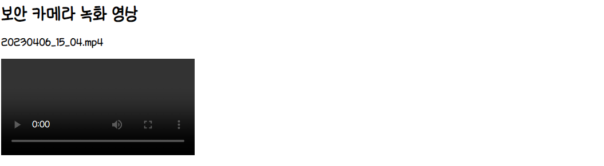
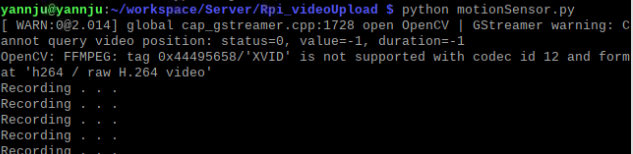
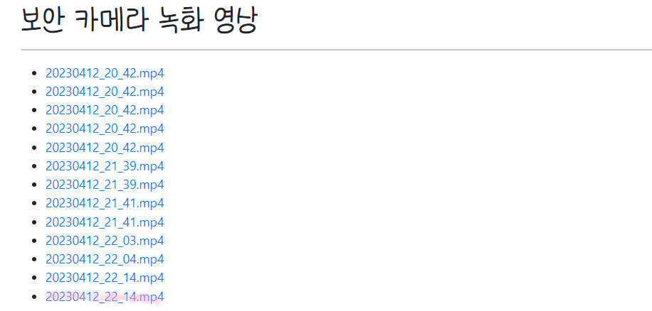
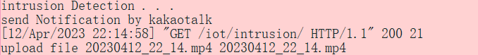

## MQTT 서비스 연동(v0.2)🗻
---
→ **조도센서** 값 해결 @^.^@!
1. ### [Custom Switch 의 상태에 따른 LED Blink](./templates/iot/mqtt.html)
   - `Custom Switch` 를 이용하여 토글이 **on** 이면 `nodeMCU`의 내장 `led` 를 **on**, 토글이 **off** 면 `led` 도 **off** 하는 기능 구현

      ```html
        <div class="custom-control custom-switch" id='ledIcon'>
        <input type="checkbox" class="custom-control-input" id="ledcontrol">
        <label class="custom-control-label" for="ledcontrol">전등</label>
        </div>
      ```
    - `<div>` 태그에 **custom-switch** 클래스를 추가하고 하단에 **custom-control-. .** 을 추가해 준다.

      
    - 위와 같이 토글이 생성된 것을 볼 수 있다.
    - `<script>` 문 내에서 해당 토글 **Element**를 이용하여 동적처리를 해준다.

      ```java
       // 생략
        let ledcontrol = document.getElementById('ledcontrol');
       // . . 중략
       // 전등 제어
        ledcontrol.onclick = () => {
          // console.log(ledcontrol.checked);
          const topic = "iot/control/led";
          let msg;

          if (ledcontrol.checked) msg = "on";
          else msg = "off";
          
          const message = new Paho.MQTT.Message(msg);
          message.destinationName = topic;
          message.qos = 1;
          
          client.send(message);
        }
      ```
    - **true** 값이 들어오면 **on**을, **false** 값이 들어오면 **off** 를 `publish` 하도록 구현하였다.
2. ### [녹화파일 업로드/다운로드_환경설정(/config/settings.py)](./config/settings.py)
   - `static` 의 경우 개발 도중 결정되는 정적파일
   - `media`의 경우 운영 도중 동적으로 생성되기 때문에 유형이 다르므로 **구분** 해준다.
   -  `MEDIA_URL` 은 웹경로, `MEDIA_ROOT` 는 OS 가 관리하는 실제 파일 정보
   - *[config/urls.py](./config/urls.py)* :  `static` 은 **load** 를 이용하여 불러올 수 있으나, `media` 는 따로 설정 해 주어야 한다.
      -  `from django.conf import settings` 가 *[/config/settings.py](./config/settings.py)* 를 의미, 이를 통해 설정파일에 접근
3. ### [녹화파일 업로드/다운로드_DB 모델 추가(/iot/models.py)](./iot/models.py)
   -  **파일 이름(원본)** 과 **파일**을 `DB`에 저장하기 위해 `SecFile` 이라는 모델을 추가
   -  **파일** 은 해당 날짜 폴더에 업로드하도록 한다.
4. ### [업로드 함수 정의(/iot/views.py)](./iot/views.py)
   - 파일에 **웹 브라우저** 가 접근하는 것이 아닌 `request` 객체가 접근
   - 이전에는 **http Response**를 이용하여 **http** 응답을 했었으나 이번에는 **json Response** 로 **Json** 응답을 진행
   - `from` 을 통해 넘어온 **csrf** 를 제외하기 위해 `csrf_exempt` 를 **import** 하고 데코레이터(`@`) 추가 
   - **request** 가 `POST` 메소드로 들어온 경우 `DB`에 저장
   - *[/iot/urls.py](./iot/urls.py)* 에 **upload** 추가
5. ### [파일 업로드 실습(fileUpload.py)](./fileUpload.py)
   - `Get`, `Post` 만 웹 브라우저 **form**  이 가능
     - `Get`은 **url** 에 정보가 붙는다. 
     - `Post`는 **body** 에 정보가 붙는다.
   - **파일명** 과 **파일의 경로** 를 이용하여 `Open` 한 **파일객체** 를 `POST`
6. ### [업로드 동영상 리스트_클래스 기반의 View생성(/iot/views.py)](./iot/views.py)
   - *[/iot/views.py](./iot/views.py)* : 클래스 기반의 `View` 를 작성
     - 장고에서는 `generic` 에 여러 `View`들이 정의되어있다.
     - ListView, DetailView, CreateView, UpdateView, DeleteView, FormView, TemplateView . . .
   - `View` 에서 작성한 **template** 을 기반으로 *[/templates/iot/sec_file_list.html](./templates/iot/sec_file_list.html)* 템플릿 작성
   - *[/iot/urls.py](./iot/urls.py)* :**url**에  `as_view()` 를 통해 `View` 연결
7. ### [업로드 된 동영상 Detail(/templates/iot/sec_file_detail.html)](./templates/iot/sec_file_detail.html)
   - **6**과 동일하게 `View` 클래스 생성 후 , `template` 에 **html** 파일 만들어 준다.
   - *[./iot/urls.py](./iot/urls.py)* 에 **url** 연결
     - `<int:pk>` 를 통해 <변환함수 : 변수명>으로 연결
     - **변수명** 은 변경 불가! ▷ 사용한 `DetailView` 에 **pk** 로 정의되어있다.
   - *[templates/iot/sec_file_list.html](./templates/iot/sec_file_list.html)*에 연결시켜주면 연결된다.

      
      
8. ### [PIR 센서 감지시 녹화 후 업로드(/Rpi_videoUpload/)](../Rpi_videoUpload/)
   ***라즈베리파이에서 동작*** 
   -  `PIR` 센서를 이용해 **움직임** 이 감지되면 **녹화** 시작 ▶ *[Rpi_videoUpload/motionSensor.py](../Rpi_videoUpload/motionSensor.py)*
      -  `.h264` 확장자로 저장

      
   -  `.mp4`로 변환 ▶ *[Rpi_videoUpload/convert.py](../Rpi_videoUpload/convert.py)*
   -  움직임 감지가 멈추면 **서버**로 업로드 ▶ *[Rpi_videoUpload/fileUpload.py](../Rpi_videoUpload/fileUpload.py)*

      
   -  이후 **메신저**로 메시지를 보내기 위해 `Request` 를 보낸다. ▶ *[Rpi_videoUpload/convert.py](../Rpi_videoUpload/convert.py)*
      -   **서버** 의 `intrusion` 에 **get** 요청을 보냄으로써 **response** 를 받아낸다. ▶ *[/iot/views.py](./iot/views.py)*

      