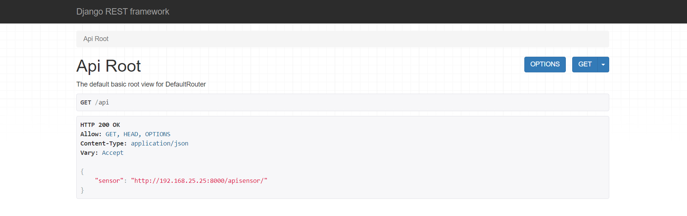
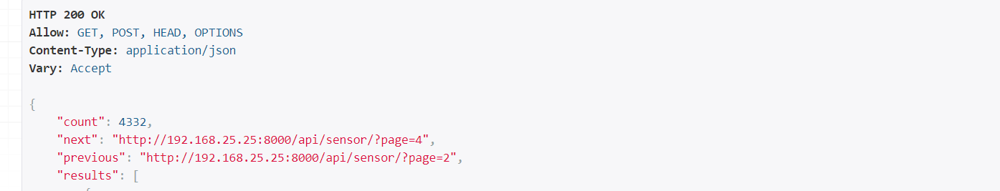

## MQTT 서비스 연동(v0.4)🥙
---
0. ### REST API 연동하기 + Android 와 연동
1. ### REST API 란
	- **Web** 서버를 제공하는데 `URI` 설계를 어떻게 할 것인가? 에 대한 정보`(CRUD)` 를 어떻게 표현할 것인가
	- 정보당 기준 `URL` 이 있고, `http 메서드`를 통해 정보(CRUD) 구분
	-  http 메서드
		- GET
		- POST
		- PUT
		- DELETE
	- 자원(정보) 를 나타내는 `URL`
	- 메시지(json 을 통해 판단)
2. ### HTTP Method
	- `GET` : READ (읽기, 상세보기)
	- `POST` : CREATE (생성)
	- `PUT` : UPDATE (수정)
	- `DELETE` : DELETE (삭제)
	- 이때 `GET, POST` 는 **ID** 없이 사용 (GET 은 **ID** 지정해서 사용하기도 한다)
3.  ### Python _ Json
	- 표준 `Python` 타입**만** 지원 (ex 리스트, 사전, ...)
	- `Django` 의 모델 클래스는 지원이 안된다 . . .
		- `Django` 의 모델클래스가 지원이 되야한다  . . . 
	- `Django Rest framework` 앱을 이용하여 한계 극복. . .!
4.  ###
    - `Django Rest framework` 설치
        - pip install djangoresframework
	- `app` 추가
    	- `python manage.py startapp api` 
    	- **api** 앱은 html 응답용 ***(x)*** json 응답용 ***(o)***
	- 모델 -> json *(직렬화)*
	- json -> 모델 *(역직렬화)*
		- 역직렬화 하는 객체 : `Serializer `
		- 이 객체를 이용하여 연결
	- *[api](./api/)* 밑에 *[Serializers(serializers.py)](./api/serializers.py)* 만들기
	- *[api/views](./api/views.py)* 에서 Sensor View Set 을 만들어 Http 메소드 처리
	- *[api/url](./api/urls.py)* 에서 라우터를 이용해 http 메소드 처리
5.  ### 웹페이지로 REST API 확인하기
   - 브라우저가 웹 페이지로 api 호출을 인지하면 `DRF(장고 프레임워크)` 가 디버깅 중 이라고 판단 -> 웹페이지로 응답
	
	    
	- 목록보기 : `get`, id **없다**
	- 상세보기 : `get`, id **있다** -> 데이터 1개만 리턴
6.  ### 페이지네이션
    - 데이터가 많이 쌓이게 되면 `페이지네이션` 을 하자
	- *[settings.py](./config/settings.py)* 에서 **REST_REAMEWORK** 설정 추가

	    