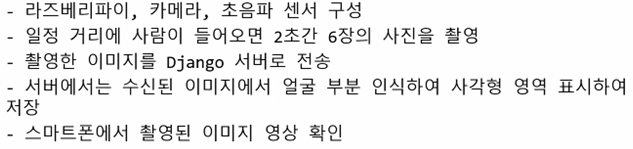

# SERVER💒
---
0. ### [nodeMCU_esp/](./nodeMCU_esp/)
   - `Django` 와 연동할 `nodeMCU` 코드 폴더 
1. ### [NodeMCU 와 Django 연동(MQTT_v0.1)](./NodeMCU_MQTT/)
   - **Release** 에서 `MQTT_v0.1` 까지의 단계
   -   `NodeMCU` 를 통해 **조도 센서** 와 **온습도 센서**의 데이터를 받아온다.
   -   `Sensor`라는 모델을 생성하여 **서버** 에서 **Subscribe**
   -   **웹 브라우저** 와 연동하기 위해 `websocket` 통신 진행
   -   브라우저 `base.html` 등 추가 구현
2. ### [전등 제어 및 파일 업로드](./NodeMCU_MQTT_v0.2/)
   - **전등 켜기/끄기** 기능 추가(`Custom Switch`)
   - **웹** 에 파일 **업로드** 하기
     - `SecFile` 이라는 모델을 생성하여 **파일** 객체를 만든다.
     - `JsonResponse` 를 이용하여 통신한다.
   - **업로드**한 파일 보기
     - `Video` 객체를 **.mp4** 확장자로 변환하여 업로드하였기 때문에 웹에서 볼 수 있다.
   - **라즈베리파이** 에서 받아온 데이터 값을 **웹** 에 업로드
     - *[/Rpi_videoUpload/](./Rpi_videoUpload/)*
3. ### [미디어 서버 만들기](./RpiServer/) 
   - **라즈베리파이**를 서버로 두고, **이미지** 혹은 **비디오** 데이터를 읽어와 웹에 띄운다. (`Mjpeg`사용) 
4. ### [프로젝트 > 사람을 감지하면 서버에 사진 전송](NodeMCU_MQTT_v0.3)

    
5. ### [REST API 연결하기](NodeMCU_MQTT_v0.4)
   - *[NodeMCU_MQTT_v0.2/](./NodeMCU_MQTT_v0.2/)*  에서 생성한 **DB** 값을 `REST API` 로 전송