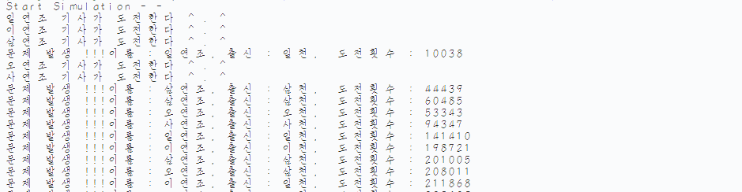

## Thread🛤
---
1. ### [th_ex01_basic.py](./th_ex01_basic.py)
   - `threading` 모듈에 **함수** 를 전달하여 실행
   - `Main thread` 가 먼저 들어올지, `Sub thread` 가 먼저 들어올지, `Sub thread` 가 끝나기 전에 `Main`이 들어올지 모른다.
2. ### [th_ex02_web_download.py](./th_ex02_web_download.py)
   - 웹 크롤링을 위해 `conda` 환경에서 진행
   - `Sub thread` 가 웹 크롤링 진행
3. ### [th_ex03_inherit_thread.py](./th_ex03_inherit_thread.py)
   - `Thread` 클래스를 **상속** 받아 운영
   - 꼭 부모 클래스의 **생성자** 를 호출해야한다.
   - `run` 을 재정의 해야한다.
      - `target` 에 주어진 **함수**의 일을 `run`에서 진행 
   - 만약 `start()` 를 하지않고 `run()`을 하면 **현재의 스레드** 가 `run`을 실행 → 작업스레드 생성되지 않는다.
   - `join()` 을 이용하면 **현재 스레드** 가 **작업 스레드** 끝날때까지 기다린다.
   - `데몬스레드` 는 **현재 스레드** 가 종료하면 함께 종료
      - 생성자에서 `self.daemon = True` 로 하여 설정 : default 는 `False`
      - 현재 스레드에서 `t.daemon = True` 로도 설정 가능 → `start()` 이전에만 실행하면 된다.
4. ### [th_ex04_Bridge.py](./th_ex04_Bridge.py) & [th_ex05_Knights.py](./th_ex05_Knights.py) & [th_ex06_bridge_knight_test.py](./th_ex06_bridge_knight_test.py)
   - 여러 스레드가 **동일 소스** 를 사용하는 경우 → 문제 발생 (`동기화 문제`)
      - EX) `Motion Sensor` 와 `Video Capture`
   - **기사** 들이 **다리** 하나를 건너기 위해 `장부` 작성
      - **기사(Knight)** : 스레드
      - **다리(Bridge)** : 연결체
   - 하나의 `Bridge` 에서 동일 변수를 사용하여 **문제가 발생** 하는 것을 볼 수 있었다.

      