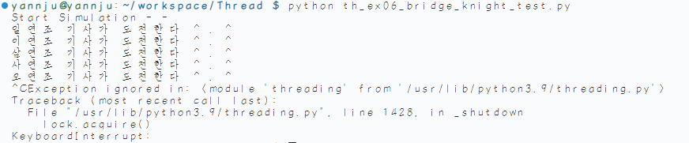

## Thread🛤
---
1. ### [th_ex01_basic.py](./th_ex01_basic.py)
   - `threading` 모듈에 **함수** 를 전달하여 실행
   - `Main thread` 가 먼저 들어올지, `Sub thread` 가 먼저 들어올지, `Sub thread` 가 끝나기 전에 `Main`이 들어올지 모른다.
2. ### [th_ex02_web_download.py](./th_ex02_web_download.py)
   - 웹 크롤링을 위해 `conda` 환경에서 진행
   - `Sub thread` 가 웹 크롤링 진행
3. ### [th_ex03_inherit_thread.py](./th_ex03_inherit_thread.py)
   - `Thread` 클래스를 **상속** 받아 운영
   - 꼭 부모 클래스의 **생성자** 를 호출해야한다.
   - `run` 을 재정의 해야한다.
      - `target` 에 주어진 **함수**의 일을 `run`에서 진행 
   - 만약 `start()` 를 하지않고 `run()`을 하면 **현재의 스레드** 가 `run`을 실행 → 작업스레드 생성되지 않는다.
   - `join()` 을 이용하면 **현재 스레드** 가 **작업 스레드** 끝날때까지 기다린다.
   - `데몬스레드` 는 **현재 스레드** 가 종료하면 함께 종료
      - 생성자에서 `self.daemon = True` 로 하여 설정 : default 는 `False`
      - 현재 스레드에서 `t.daemon = True` 로도 설정 가능 → `start()` 이전에만 실행하면 된다.
4. ### [th_ex04_Bridge.py](./th_ex04_Bridge.py) & [th_ex05_Knights.py](./th_ex05_Knights.py) & [th_ex06_bridge_knight_test.py](./th_ex06_bridge_knight_test.py)
   - 여러 스레드가 **동일 소스** 를 사용하는 경우 → 문제 발생 (`동기화 문제`)
      - EX) `Motion Sensor` 와 `Video Capture`
   - **기사** 들이 **다리** 하나를 건너기 위해 `장부` 작성
      - **기사(Knight)** : 스레드
      - **다리(Bridge)** : 연결체
   - 이름과 출신의 **맨 앞 글자** 가 다르면 **문제가 발생** 하도록 구현하였는데 다음과 같이 **맨 앞 글자** 가 같은 경우에도 **오류** 가 발생
      
   - **맨 앞 글자** 가 같음에도 **오류** 발생
      - 여러 스레드가 동작하면서 **동일 변수(공유자원)** 에 접근
      - **맨 앞 글자** 가 달랐을 때 `to_String` 을 실행
      - `to_String` 에서 **return** 할때 기존 스레드가 **마저** 진행되어 **맨 앞 글자** 가 같아지는 경우 발생
   - 어떻게 해결해야 할까?
      - 공유자원에 접근(**Write**)하는 부분(`Critical Section`)에 `Lock` 을 건다.
      - `acquire()` : `Lock` 걸기
      - `release()` : `Lock` 풀기
      - `Lock` 이 걸려있으면 진입을 기다린다. (**대기상태**)
   - `Lock` 클래스를 호출하여 적용하면 다음과 같이 오류 없이 진행된다. (**Ctrl+C** 를 이용해 프로그램 종료)
   
      
5. ### [th_ex07_producer.py](./th_ex07_producer.py) & [th_ex08_consumer.py](./th_ex08_consumer.py) & [th_ex09_main.py](./th_ex09_main.py)
   - **생성자** 와 **소비자** 구조
   - `Producer` 와 `Consumer` 가 실행되는 속도가 다르다고 가정
   - `Producer` 가 더 빠르다면 **Queue** 에 계속 데이터가 쌓이게 된다.
       - **Queue** 가 꽉 차게 되면 `Producer` 는 기다린다 . .
   - `Consumer` 가 더 빠르다면 **Queue** 가 비게 된다.
       - **Queue** 가 비게 되면 `Consumer`는 기다린다 . .
   - `put()` 을 할 때 **default** 로 **block** 이 True 로 되어있다.
       - 이것은 **Queue** 가 꽉 차게 되면 슬롯이 확보될 때 까지 `블록` 한다는 의미
6. ### [th_ex10_timer1.py](./th_ex10_timer1.py) & [th_ex11_timer2.py](./th_ex11_timer2.py)
   - `Timer` 객체는 **Start()** 를 통해 타이머가 시작
   - `Restart` 는 할 수 없다.
       - 하고싶다면 `Cancel` 후 다시 **객체를 생성** 해주고 `Start` 를 해 주어야 한다.
